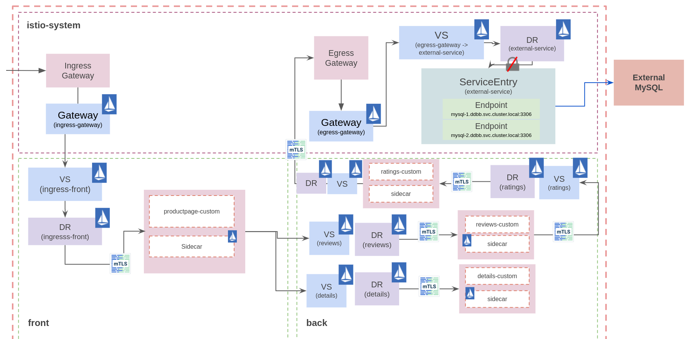

# Red Hat OpenShift demo
This repository contains the required tasks to install and configure Red Hat OpenShift Service Mesh in a OCP cluster, and deploy an example application.

## Prerequisites
 - OCP cluster up and running with version 4.6 or higher.
 - OC cli installed.

## Installation and basic configuration
### Installing the operators:

Jaeger
```bash
oc apply -f 1-ossm-operators/jaeger-operator.yaml
```

Kiali
```bash
oc apply -f 1-ossm-operators/kiali-operator.yaml
```

OSSM
```bash
oc apply -f 1-ossm-operators/ossm-operator.yaml
```

```bash
oc get clusterserviceversions.operators.coreos.com
---
NAME                         DISPLAY                                          VERSION   REPLACES                     PHASE
jaeger-operator.v1.28.0      Red Hat OpenShift distributed tracing platform   1.28.0                                 Succeeded
kiali-operator.v1.36.7       Kiali Operator                                   1.36.7    kiali-operator.v1.36.6       Succeeded
servicemeshoperator.v2.1.1   Red Hat OpenShift Service Mesh                   2.1.1-0   servicemeshoperator.v2.1.0   Succeeded
```

### Installing the Service Mesh Control Plane
Now, the operators are installed and it is time to install the Service Mesh Control Plane with the configuration desired. For this, set the [SMCP Configuration](./2-ossm/basic.yaml) file up with your preferences and install it.

Create the istio-system namespace
```
oc new-project istio-system
```

Install the Service Mesh Control Plane
```
oc apply -f 2-ossm/basic.yaml
```

You can check the installation by executing
```
oc get smcp -n istio-system
----
NAME    READY   STATUS            PROFILES      VERSION   AGE
basic   10/10   ComponentsReady   ["default"]   2.1.1     2m10s
```

## Adding services to the mesh
There are two ways for joining namespaces to the Service Mesh: SMMR and SMM.
### Openshift Service Mesh member roll (SMMR)

The *ServiceMeshMemberRoll* object list the projects that belong to the Control Plane. Any project that is not set in this object, is threated as external to the Service Mesh. This object must exist in the Service Mesh with name *default*.

Create the SMMR
```
oc apply -f 2-ossm/smmr.yaml
```

A namespace called *my-awesome-project* exists in the OCP cluster and it will be joined to the Service Mesh:
```bash
oc get smmr default -oyaml
---
NAME      READY   STATUS       AGE
default   1/1     Configured   5s
```

### Openshift Service Mesh member
Using this object, users who don't have privileges to add members to the *ServiceMeshMemberRoll* (e.g. users who can't access the Control Plane's namespace) can join their namespaces to the Service Mesh. But, these users need the *mesh-user* role.

If you try to create the Service Mesh Member object, you will receive the following error:
```
oc apply -f 2-ossm/smm.yaml
----
Error from server: error when creating "2-smcp/smm-2.yaml": admission webhook "smm.validation.maistra.io" denied the request: user '$user' does not have permission to use ServiceMeshControlPlane istio-system/basic
```

Grant user permissions to access the mesh by granting the *mesh-user* role:
```
oc policy add-role-to-user -n istio-system --role-namespace istio-system mesh-user $user
```

This use case will be use in the application deployment step.

## Deploying the bookinfo example application
It is time to deploy the bookinfo sample application. The bookinfo sample application with external ratings database using an egress Gateway for routing TCP traffic. The bookinfo application will be deployed in two namespaces simulating front and back tiers.

Three MySQL instances are deployed outside the Mesh in the _ddbb_ project: mysql-1, mysql-2 and mysql-3. Each mysql instance has a different rating number that will be consumed by the ratings application:
* mysql-1: Ratings point equals 1.
* mysql-2: Ratings point equals 5.
* mysql-3: Ratings point equals 3.

Thus, the traffic will be balanced between the different MySQL instances.

### App diagram
The traffic flow is:
1. The sidecar intercept the request from the app container (ratings) to _mysql_.
2. The Virtual Service and Destination Rule objects route the request from the sidecar (back) to the egress Gateway (istio-system).
3. At this point, the Virtual Service and Kubernetes Services objects resolve the endpoints and route the traffic through the egress Gateway.



### Deploying the MySQL instances
As cluster-admin
```bash
oc new-project ddbb
oc create -n ddbb secret generic mysql-credentials-1 --from-env-file=./mysql-deploy/params.env
oc create -n ddbb secret generic mysql-credentials-2 --from-env-file=./mysql-deploy/params-2.env
oc create -n ddbb secret generic mysql-credentials-3 --from-env-file=./mysql-deploy/params-3.env
oc process -f mysql-deploy/mysql-template.yaml --param-file=mysql-deploy/params.env | oc create -n ddbb -f -
oc process -f mysql-deploy/mysql-template.yaml --param-file=mysql-deploy/params-2.env | oc create -n ddbb -f -
oc process -f mysql-deploy/mysql-template.yaml --param-file=mysql-deploy/params-3.env | oc create -n ddbb -f -
```

All the MySQL instances should be running in _ddbb_ project.

### Deploy Custom Bookinfo application in separated Namespaces (productpage=front, reviews|ratings|details=back)

#### Default OSSM networking
First, create the Ingress Gateway and the OCP public route for the bookinfo application.

Get the default ingress controller domain
```bash
OCP_DOMAIN=$(oc -n openshift-ingress-operator get ingresscontrollers default -o json | jq -r '.status.domain')
```

Replace the $EXTERNAL_DOMAIN variable in the [Gateway object](./3-ossm-networking/gw-ingress-http.yaml) and [OpenShift route object](./3-ossm-networking/route-bookinfo.yaml). Create Gateway and OpenShift route.

```bash
find ./3-ossm-networking/ -type f -print0 | xargs -0 sed -i "s/\$EXTERNAL_DOMAIN/$OCP_DOMAIN/g"
```

Create the Istio Ingress Gateway
```bash
oc apply -f ./3-ossm-networking/gw-ingress-http.yaml
oc apply -f ./3-ossm-networking/route-bookinfo.yaml
```

#### Deploying the front application
It is time to deploy the bookinfo sample application in separated namespaces.

Create the front project
```bash
oc new-project front
```

Create the SMM to join the _front_ namespace into the mesh
```bash
oc apply -n front -f 4-front/smm-front.yaml
```

Deploy the bookinfo sample application
```bash
oc apply -n front -f 4-front/bookinfo-front.yaml
```

Create Virtual Services, Destination Rules and OpenShift route for the front application
```bash
find ./4-front/ -type f -print0 | xargs -0 sed -i "s/\$EXTERNAL_DOMAIN/$OCP_DOMAIN/g"
oc apply -n front -f 4-front/vs-front.yaml
oc apply -n front -f 4-front/dr-front.yaml
```


#### Deploying the back application
Create the back project:
```bash
oc new-project back
```

Create the SMM to join the _front_ namespace into the mesh:
```bash
oc apply -n back -f 5-back/smm-back.yaml
```

Deploy reviews and details applications:
```bash
oc apply -n back -f 5-back/bookinfo-back.yaml
```


Deploy ratings application with MySQL configuration:
```bash
oc process -f 5-back/bookinfo-ratings-mysql.yaml --param-file=./5-back/params.env | oc apply -n back -f -
```

Route all the traffic destined to the _reviews_ service to its __v3__ version and route all the traffic destined to the _ratings_ service to _ratings v2-mysql_ that uses the MySQL databases previously deployed.

```bash
oc apply -n back -f 5-back/vs-ratings-mysql.yaml
oc apply -n back -f 5-back/dr-back.yaml
```

At this point, the bookinfo application is up and running and set with external database, but ratings application is not able to retrieve any data from any mysql instance.


Now, it's time to create the Istio objects to route the traffic through an egress Gateway in order to reach the _mysql_ external DDBB.

1. Route the traffic from _ratings_ to the  egress gateway located in _istio-system_ namespace.

Create Istio objects
```bash
oc apply -f 6-ratings-egress/svc-mysql.yaml

CLUSTER_IP=$(oc get svc mysql -n istio-system -o json | jq -r '.spec.clusterIP')
find ./6-ratings-egress/ -type f -print0 | xargs -0 sed -i "s/\$CLUSTER_IP/$CLUSTER_IP/g"

oc apply -f 6-ratings-egress/dr-ratings-egress.yaml
oc apply -f 6-ratings-egress/vs-ratings-egress.yaml
```

2. Route the traffic from the egress gateway to the external service.
```bash
oc apply -n istio-system -f 6-ratings-egress/istio-system/
```
### Traffic management use cases
## Lab 1: Request routing
OpenShift Service Mesh by default routes requests in a round robin manner.

### Route traffic to a specific version
In this lab we will apply the rules to make all requests go to version 2 of reviews so we can see the stars ratings.

Route the traffic to the _v2_ subset:
```bash
oc apply -n back -f 7-traffic-management/lab1/vs-reviews-v2.yaml
```

### Route traffic based on headers
Now let’s think that we have a new version for the application and you want to deploy it first to a set of premium users. We are going to see how to do that in this lab where we are going to route the requests from one user in particular to version 3 of the reviews service.

Route the traffic based on the header defined in the VS:
```bash
oc apply -n back -f 7-traffic-management/lab1/vs-reviews-headers.yaml
```

To test it, click on the Sign in button at the top right of the Product Page and login as "test-user", or the user you editted in the yaml if you decided to do that. You have to write it exactly like in the yaml. And you can type whatever you want in the Password field.

Finally, delete the VS used
```
oc delete -n back -f 7-traffic-management/lab1/
```

## Lab 2: Traffic Shifting and Weight Balancing
In this lab you will learn how to gradually migrate traffic from one version of a service to another.


For example, you might migrate traffic from an older version to a new version. In this example you will use reviews:v1 service as the old version and reviews:v3 service as the new version.

### Route 10% of the traffic to a new service
The first modification to the _reviews_ VS to add a 90/10 routing rule.

Note that the sum of weights across destinations should be == 100. If there is only one destination in a rule, the weight value is assumed to be 100.

Apply this configuration:
```bash
oc apply -n back -f 7-traffic-management/lab2/vs-reviews-shifting-90-10.yaml
```

### Route half the traffic to each service
The _reviews_ VS to add a 50/50 routing rule.

Apply this configuration:
```bash
oc apply -n back -f 7-traffic-management/lab2/vs-reviews-shifting-50-50.yaml
```

### Delete VS
Finally, delete the VS used
```
oc delete -n back -f 7-traffic-management/lab2/
```

### Route all the traffic to the new service
The _reviews_ VS to add a 100% routing rule to the new service.

Apply this configuration:
```bash
oc apply -n back -f 7-traffic-management/lab2/vs-reviews-shifting-0-100.yaml
```

## Lab 3: Fault Injection
OpenShift Service Mesh has mechanisms to inject faults in your application to test how it will behave when a real fault happens. This is very useful to check if your application’s recovery policies aren’t too restrictive.


In this lab you will inject two different faults in your application. A delay and an abort. Delays are timing failures and aborts are crash failures. You are going to use a similar method than in Lab 1 - Requests Routing when you routed requests using http headers, but this time you are going to inject faults for user "test-user".

### Delay
For the delay you are going to add 7 seconds of delay between the _reviews_ and _ratings_ services.

Apply the delay:
```bash
oc apply -n back -f 7-traffic-management/lab3/vs-delay.yaml
```

Visit the **bookinfo** page and login with the _test-user_ username. You will notice that it will take 7 seconds to load and you will see the following error in the reviews part: "Sorry, product reviews are currently unavailable for this book.".

This happens because there is a hard-coded timeout between _productpage_ service and _reviews_ service of 3 seconds and 1 retry, so a total of 6 seconds. Then, you can’t see the _reviews_ because of this timeout.

### Abort
Apply the abort:
```bash
oc apply -n back -f 7-traffic-management/lab3/vs-abort.yaml
```

Now you don’t have to be logged in as _test-user_, enter again to your Product Page and now you will see the _reviews_, but the ratings will give you the following error: "Ratings service is currently unavailable". This is because this time the _ratings_ service is returning an error 500.

### Delete VS
Finally, delete the VS used
```bash
oc delete -n back -f 7-traffic-management/lab3/
```

## Lab 4: Requests timeouts
A timeout for HTTP requests can be specified using the timeout field in the VS. By default, the timeout is 15 seconds, but in this task you override the _reviews_ service timeout to 1 second.

To see its effect, however, you also introduce an artificial 2 second delay in calls to the _ratings_ service.

### Adding a delay to ratings service
First, route requests to reviews:v2 service (a version that calls the ratings service).

Apply this configuration:
```bash
oc apply -n back -f 7-traffic-management/lab4/vs-reviews-v2.yaml
```

Add a 2 second delay to calls to the _ratings_ service:
Apply this configuration:
```bash
oc apply -n back -f 7-traffic-management/lab4/vs-ratings-delay.yaml
```

### Adding a timeout to reviews service
Now add a half second request timeout for calls to the _reviews_ service.

Apply this configuration:
```bash
oc apply -n back -f 7-traffic-management/lab4/vs-reviews-timeout.yaml
```

### Delete VS
Finally, delete the VS used
```bash
oc delete -n back -f 7-traffic-management/lab4/
```

## Lab 5: Circuit Breaking & Outlier Detection
### Circuit Breaking
In this lab you are going to configure circuit breaking for connections. This is very important for building resilient microservices, since it helps to limit the impact of failures and latency spikes.

For this task, we will start by setting a CircuitBreaking in reviews service in order to limit to a single connection and request to it.

Configure this change by executing:
```bash
oc apply -n back -f 7-traffic-management/lab5/reviews-only-to-v2-and-cb.yaml
```

To validate that everything works fine with a single connection to that service, run:
```bash
export GATEWAY_URL=$(oc get route bookinfo -n istio-system -o jsonpath='{.spec.host}')
while true; do curl -s http://$GATEWAY_URL/productpage | grep -i reviews; sleep 0.5 ; done

      <h4 class="text-center text-primary">Book Reviews</h4>
      <h4 class="text-center text-primary">Book Reviews</h4>
      <h4 class="text-center text-primary">Book Reviews</h4>
      ......
```
Notice that 100% of the traffic is succesfully managed by reviews service. In addition, there is a 'ray' icon in the reviews application square that identify the presence of a CB definition.

Let’s now generate some load…​ by adding a 10 clients calling out bookinfo app:
```bash
seq 1 10 | xargs -n1 -P10 curl -s http://$GATEWAY_URL/productpage | grep -i reviews

      <h4 class="text-center text-primary">Book Reviews</h4>
      <h4 class="text-center text-primary">Book Reviews</h4>
      <h4 class="text-center text-primary">Book Reviews</h4>
      <h4 class="text-center text-primary">Error fetching product reviews!</h4>
      <p>Sorry, product reviews are currently unavailable for this book.</p>
      <h4 class="text-center text-primary">Book Reviews</h4>
      <h4 class="text-center text-primary">Book Reviews</h4>
      <h4 class="text-center text-primary">Error fetching product reviews!</h4>
      <p>Sorry, product reviews are currently unavailable for this book.</p>
```

### Outlier Detection
In this lab, we are going to discover how an unhealthy pod, which we don't know which one is, it is responding with 5x errors.

First, we need to deploy a custom ratings deployment:
```bash
oc apply -n back -f 7-traffic-management/lab5/deploy-ratings.yaml
```

Route all the traffic to the v1 version of *ratings* microservice
```bash
oc apply -n back -f 7-traffic-management/lab5/vsdr-ratings-v1.yaml
```

Then, let’s randomly make one pod of our ratings service to fail by executing:
```bash
oc exec -n back -c ratings  $(oc get pods -n back -o NAME | grep ratings-v1 | tail -n1) -- curl -s ratings:9080/faulty

{"status":"A ratings pod will start to fail"}
```

And run some tests now. Let’s have a look at the output as there will be some failures comming from an unknown (yet) ratings pod:
```bash
export GATEWAY_URL=$(oc get route bookinfo -n istio-system -o jsonpath='{.spec.host}')
while true; do curl -s http://$GATEWAY_URL/productpage | egrep "Reviewer1|Reviewer2|Ratings service is currently unavailable"; sleep 0.5 ; done
        <small>Reviewer1</small>
        <small>Reviewer2</small>
        <small>Reviewer1</small>
        <small>Reviewer2</small>
        <small>Reviewer1</small>
        <p><i>Ratings service is currently unavailable</i></p>
        <small>Reviewer2</small>
        <p><i>Ratings service is currently unavailable</i></p>
        <small>Reviewer1</small>
        <small>Reviewer2</small>
        <small>Reviewer1</small>
        <small>Reviewer2</small>
        <small>Reviewer1</small>
        <small>Reviewer2</small>
        <small>Reviewer1</small>
        <p><i>Ratings service is currently unavailable</i></p>
        <small>Reviewer2</small>
        <p><i>Ratings service is currently unavailable</i></p>
```

It is time to make our services mesh more resiliant and see the effect of applying an OutlierDetection policy over ratings service:
```bash
oc apply -n back -f 7-traffic-management/lab5/dr-ratings-outlier-detection.yaml
```

Once the OutlierDetection has been applied to ratings service, run some tests again. You should notice that there should only be some errors at the begining of the test.

### Delete VS
Finally, delete the VS used
```bash
oc delete -n back -f 7-traffic-management/lab5/
```

## Lab 6: Mirroring and Dark launches
Traffic mirroring, also called shadowing, is a powerful concept that allows feature teams to bring changes to production with as little risk as possible.


Mirroring sends a copy of live traffic to a mirrored service. The mirrored traffic happens out of band of the critical request path for the primary service.


In this lab, you will first force all traffic to reviews:v1 service. Then, you will apply a rule to mirror a portion of traffic to reviews:v2.

Apply this configuration:
```bash
oc apply -n back -f 7-traffic-management/lab6/vs-reviews-mirroring.yaml
```

Now, in the istio-proxy of _reviews-v2_ pod you will find requests from this mirror configuration. Check that authority field is set as _reviews-shadow:9080_.

### Delete VS
Finally, delete the VS used
```bash
oc delete -n back -f 7-traffic-management/lab6/
```

## Cleanup
### MySQL Instances
Delete MySQL DeploymentConfigs
```bash
oc process -f mysql-deploy/mysql-template.yaml --param-file=mysql-deploy/params.env | oc delete -n ddbb -f -
oc process -f mysql-deploy/mysql-template.yaml --param-file=mysql-deploy/params-2.env | oc delete -n ddbb -f -
oc process -f mysql-deploy/mysql-template.yaml --param-file=mysql-deploy/params-3.env | oc delete -n ddbb -f -
```

Delete secrets
```bash
oc delete -n ddbb secret mysql-credentials-1
oc delete -n ddbb secret mysql-credentials-2
oc delete -n ddbb secret mysql-credentials-3
```

Delete OCP project
```bash
oc delete project ddbb
```
### Bookinfo
#### Bookinfo

Delete Istio objects
```bash
oc delete -f 6-ratings-egress/istio-system/
oc delete -f 6-ratings-egress/
oc delete -f 5-back/
oc delete -f 4-front/
oc delete -f 3-ossm-networking/
```

Delete OCP project
```bash
oc delete project back
oc delete project front
```